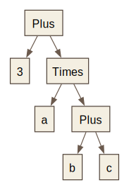
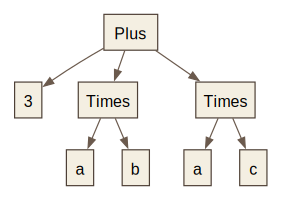

# Howl

Howl (**H**askell **O**pen **W**olfram **L**anguage interpreter) is an implementation of a microscopic subset of the [Wolfram Language](https://www.wolfram.com/language/) (which powers Mathematica), in Haskell. It is both a Haskell library and executable. As a Haskell library, Howl makes it easy to define replacement rules using Haskell functions, and thereby use Haskell to manipulate algebraic expressions. One can also define replacement rules using the usual Wolfram Language syntax, or a mixture of both languages, see [Builtins.hs](https://github.com/davidsd/howl/blob/main/src/Howl/Builtins.hs) as an example.

Mathematica is a registered trademark of Wolfram Research, Inc., and Wolfram Language is a trademark of Wolfram Research, Inc.; this project is independent and not affiliated with, endorsed by, or sponsored by Wolfram Research.

## Installation

You can build with stack:

```bash
git clone https://github.com/davidsd/howl.git
cd howl
stack build
```

## Usage

The main executable is `howl-exe`.

Start the REPL with `stack`:
```bash
stack run howl-exe
```

Evaluate a single expression without entering the REPL:
```bash
stack run howl-exe -- --expr 'Expand[(x + 1)^3]'
```

Load a file and (optionally) evaluate an expression:
```bash
stack run howl-exe -- --file examples/wl/fib.wl --expr 'fib[10]'
```

There are also some example executables in the repository:
```bash
stack run fib
stack run laplace
```

### Jupyter

Howl can be used as a kernel for a [Jupyter](https://jupyter.org/) notebook. To install the kernel, first install Jupyter, then run

```bash
stack exec howl-jupyter -- install
```

To use it, start Jupyter:
```bash
jupyter lab
```

and select the `Howl` kernel when creating a notebook.

## Prior art

The core algorithm needed to implement the Wolfram Language is a procedure for matching patterns to expressions (see below for details). Howl implements the algorithm $M_\textrm{Mma}$ described in [Variadic equational matching in associative and commutative theories](https://www.sciencedirect.com/science/article/pii/S0747717121000079) by Besik Dundua, Temur Kutsia, and Mircea Marin
[pdf](https://www3.risc.jku.at/publications/download/risc_6260/variadic-equational-matching-jsc-final-with-mma-versions.pdf). 

[loris](https://github.com/rljacobson/loris) is another implementation (in Rust) of the Wolfram Language based on the Dundua-Kutsia-Marin paper. Loris was important inspiration for Howl.

[mathics](https://mathics.org/) is "A free, open-source alternative to Mathematica", implemented in Python. Unlike Howl, Mathics makes a reasonable attempt towards feature parity with Mathematica, including implementing a much larger proportion of Mathematica's standard library, providing a notebook interface, graphics features, and much more.

[Woxi](https://woxi.ad-si.com/) is a Wolfram Language interpreter written in Rust.

[mmaclone](https://github.com/jyh1/mmaclone) is another Wolfram Language interpreter written in Haskell.

## Background: trees and replacement rules

Mathematica is essentially an engine for repeatedly applying replacement rules to trees of data. A mathematical expression is represented as a tree. For example, the expression `3+a(b+c)` can be written `Plus[3,Times[a,Plus[b,c]]]`, which as a tree looks like this:



`Plus`, `Times`, `a`,`b`, and `c` are all symbols, while 3 is an integer literal.

Replacement rules have a pattern on the left-hand side and an expression on the right-hand side. For example, we might define the rule

```mathematica
(* Distributive property *)
Times[x_,Plus[y_,z_]] := Plus[Times[x,y],Times[x,z]];
```

Alternatively, we can write it using some syntactic sugar as

```mathematica
(* Distributive property again *)
x_(y_+z_) := x y + x z;
```

If we add this to the global rules, then Mathematica will recognize that part of the tree above matches the left-hand side of this rule with the substitutions `{x -> a, y -> b, z -> c}`. It will then replace that part of the tree with the right-hand side of the rule, with the given substitutions, giving in this case `3+(a b+a c)`. Mathematica also knows that `Plus` is "Flat", i.e. associative, so it will further simplify this expression to `3 + a b + a c`, which as a tree looks like this



In actuality, this example doesn't work in Mathematica because the symbol `Times` is protected and you are not allowed to define new rules for it. But you can do it in Howl:

```
Howl, version 0.1 :? for help
In[1]:= x_(y_+z_) := x y + x z;
In[2]:= 3 + a (b + c)
Out[2]= 3 + a b + a c
```

## Interoperation with Haskell

When Howl is used as a Haskell library, you can easily define replacement rules that use Haskell functions.
```haskell
{-# LANGUAGE OverloadedStrings #-}

module Main where

import Howl

fibs :: [Integer]
fibs = 0 : 1 : zipWith (+) fibs (tail fibs)

myProgram :: Eval ()
myProgram = do
  def "Fib" (fibs !!)
  run_ "Print[Expand[(x + Fib[100])^Fib[3]]]"

-- Prints: 125475243067621153271396401396356512255625 + x^2 + 708449696358523830150 x
main :: IO ()
main = runEval myProgram
```
The type `(fibs !!) :: Int -> Integer` is used to define a rule that only matches expressions of the form `Fib[n]` where `n` is an integer literal. For example, `Fib["hi"]` doesn't match the rule we defined, and will remain unevaluated. The typeclasses `ToExpr`/`FromExpr` are used to automatically convert `Expr`s to and from Haskell data.

Why would you want to do this? Well, it is generally horrible to write actual programs in Mathematica. It does not have a type system, it is slow, lists are the only conveniently available data structure, editing interfaces are bad. So instead, you can write your programs in Haskell. But Haskell does not have much in the way of computer algebra. So if you need mathematical expressions and simplification using replacement rules, you could use a `Howl` `Expr`.

## Some differences from Mathematica

Here is a woefully incomplete list of differences between Howl and Mathematica

- Howl has a few dozen functions in the standard library. Mathematica version 14.0 has 6,600 builtin functions.

- Howl is slower than Mathematica. How much slower depends on the program. For example, the following program takes 40 seconds to run in Howl and 7 seconds in Mathematica, on my M4 Max laptop:
  ```mathematica
  fib[0] := 0;
  fib[1] := 1;
  fib[n_] := fib[n-1] + fib[n-2];
  fib[35]
  ```
  If you know how to make it faster, please tell me!

- Howl does not evaluate patterns as if they were expressions. In other words, you can imagine that every pattern in Howl is wrapped in `HoldPattern`.

- With one exception (below), Howl does not currently attempt to sort user-defined rules in reverse order of specificity. By default, it stores rules in the order that they are defined. For example:
  ```mathematica
  Foo[_,_] := True;
  Foo[3,_] := False;
  (* Evaluates to False in Mathematica, but True in Howl *)
  Foo[3,7]
  ```
  The exception is when the pattern on the left-hand side matches a unique expression (and does not bind any variables). In this case, Howl stores the rule in a Map which it queries first before trying other rules sequentially. For example
  ```mathematica
  Foo[_] := True;
  Foo[3] := False;
  (* Evaluates to False in Mathematica and Howl, because Foo[3] matches precisely 1 expression. *)
  Foo[3]
  ```
  As another example, this means that memoization works as expected:
  ```mathematica
  fib[0] := 0;
  fib[1] := 1;
  fib[n_] := fib[n] = fib[n-1] + fib[n-2];
  (* Evaluates to 280571172992510140037611932413038677189525 and does not hang forever. *)
  fib[200]
  ```

- Howl does not have `Block` or `With`. Instead, it defines `Let`, which implements shadowing, as is standard in most functional languages. For example:
  ```
  In[1]:= Let[x=12,Let[x=9,x+3]+x]
  Out[1]= 24
  ```
  Internally, `Let` is defined in terms of `Function`: `Let[x=a,expr] --> Function[x,expr][a]`. `Let` also lets you sanely define successive variables that depend on previous ones:
  ```
  In[1]:= Let[{x=1,y=x+2,z=x+y+3}, z+4]
  Out[1]= 11
  ```

- Howl implements the attributes `Flat`, `Orderless`, `HoldAll`, `HoldFirst`, and `HoldRest`. It does not (yet) have the attribute `OneIdentity`. It also does not yet implement `Evaluate` or `Unevaluated`. It also does not implement `Listable`, and hopefully it never will. Please use `Map` instead.

- Attributes must be set before rules are defined. The reason is that the left-hand side is compiled into a pattern, and the way compilation works depends on the attributes of the symbols in the pattern. If these attributes are changed later, the compiled pattern that is already in the Context will not be updated.

- Howl does not match subexpressions under a `Flat` `Orderless` in the same way as Mathematica. For example, in Mathematica, you can do
  ```
  In[1]:= a b c /. {a c :> Foobar}
  Out[1]= b Foobar
  ```
  Howl does not recognize that `Times[a,b,c]` can be rewritten as `Times[Times[a,c],b]` which has `Times[a,c]` as a sub-expression that matches the pattern. However, you can do this:
  ```
  In[1]:= a b c /. {a c x___ :> Foobar x}
  Out[1]= b Foobar
  ```
  This works because the left-hand side matches the whole expression `a b c`, taking into account commutativity of `Times` (which the Howl pattern matcher does).
  
## Some thoughts about this whole idea

Howl is an experiment. Before actually using Howl in practice, you should probably ask:

- Can I just write everything in Haskell and bypass Howl `Expr`s and the Howl evaluator? If the answer is yes, you should do it.

- Do I want to spend my time writing Haskell functions that implement missing features in the Howl standard library just so I can run Wolfram Language programs that use those features? If the answer is no, you shouldn't do it.

I haven't yet found a real situation where the answers to these questions are "no" and "yes". Please let me know if you encounter one.

Still, Wolfram Language patterns are a concise way to express symbolic rules that can be cumbersome to implement in Haskell. For example, [vector_calculus.wl](https://github.com/davidsd/howl/blob/main/examples/wl/vector_calculus.wl) gives a concise set of rules for performing basic vector calculus. It is a pain to implement this kind of thing directly in Haskell, see [orthogonal-reps](https://gitlab.com/davidsd/orthogonal-reps) for an example. It would be nice if Haskell had native support for sequence variables and some of the more powerful features of Wolfram Language patterns. When doing symbolic manipulation, it is also nice to sometimes *not* have types: will the arguments of `Exp` be integers or rationals or rational functions of some variables or square roots of other expressions? Sometimes you don't know yet, and you don't want to worry about this.
